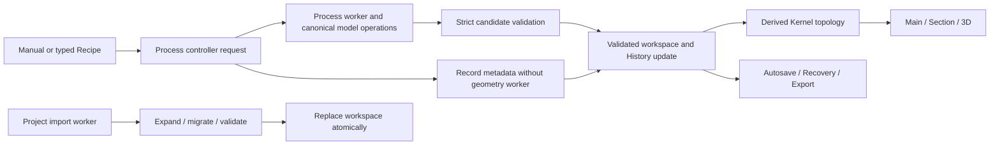

# Architecture

## Scope

WaferCAD is a static browser application. There is no runtime backend, desktop client, or server-side geometry service in the active architecture.

Product positioning is **Visual Process CAD / geometric process emulation**. The architecture is optimized for fast mask-to-topography reasoning and synchronized inspection, not for predictive process physics. The canonical model therefore stays vector 2.5D, while higher-detail morphology and Implant visualization are explicit render/annotation layers with documented limits.

The product is centered on four synchronized views: Mask, 3D, Main, and Section A–B.

## Core geometry

The canonical model is a **vector 2.5D region stack**.

Each model contains:

- a vector base boundary in XY;
- non-overlapping XY polygon regions;
- an ordered Z stack for each region;
- stable layer IDs with editable display name and color;
- optional deterministic surface-appearance metadata on exposed front/back segment faces;
- Implant annotations stored separately from material layers and clipped against current material geometry for rendering;
- Electrical Region annotations stored independently from Implant/material solids for induced, doped, inversion, accumulation, depletion, and interface-region visualization.

A region is conceptually:

```text
Region
├─ geom: MultiPolygon in XY
└─ stack
   ├─ { layerId, z0, z1 }
   └─ ...
```

X, Y and Z are physical geometry stored internally in micrometres. The UI has one global display/input-unit layer (nm / µm / mm) for all three axes.

The stored model is intentionally 2.5D: XY footprints are vector polygons and vertical structure is represented by Z intervals. Runtime Process Geometry Kernel v2 derives a unified surface topology from that canonical model, so Process, Section, and 3D agree on exposed faces, buried material interfaces, true voids, numerical cracks, and genuine vertical walls without introducing a full arbitrary-solid B-rep kernel.

### Canonical repeated arrays

Large repeated wafers may use the canonical array kernel instead of eagerly expanding every site. An array model stores shared leaf templates, translated instances, and exclusive tile domains while preserving the same physical layer/region/annotation semantics as an ordinary model. `site/model-array.js` owns array validation, bounded resolution and copy-on-write template separation; `site/model-array-process.js` applies Process operations by physical context; `site/model-array-rendering.js` derives repeated render ownership and GPU-instancing groups without creating artificial tile interfaces.

Array-aware caches are derived runtime accelerators, not new physical truth. The mask instance index, Process boundary index, renderer ownership/triangulation caches and retained Process worker may be rebuilt or discarded at any time. Their keys must follow canonical geometry/revision/context identity, and they are never serialized into History or project files.

Project storage uses `shared-assets-v4` for canonical arrays: shared model templates and instance lists are stored compactly alongside the existing shared geometry/model/layout dictionaries. Older unencoded/v1/v2/v3 projects remain readable; applications that do not support v4 must reject canonical-array projects rather than silently dropping repeated geometry.

## State and transaction flow



Canonical region stacks and IDs are physical truth. Topology, meshes, caches, display scaling and inspection ROI are derived. Process failures discard candidates; imports validate before replacement; History and storage keep exact restorable states. The [documentation architecture](DOCUMENTATION.md) describes ownership of prose and generated references separately from runtime architecture.

## Modules

### `site/app.js`

Owns application state and top-level controller composition. Detailed 2D Mask/Main/Section drawing is delegated to `site/plan-renderers.js`; Process panel state/request orchestration is delegated to `site/controllers/process-panel-controller.js`; History edit/insert transactions live in `site/controllers/history-mutation-controller.js`; browser autosave/Recovery/safe-reload orchestration is delegated to `site/controllers/workspace-persistence-controller.js`; synchronized view refresh/base summaries live in `site/controllers/workspace-view-controller.js`; mask/ROI process-selection geometry lives in `site/selection-geometry.js`; Project toolbar and History-tree presentation live in `site/controllers/project-controller.js`; the 3D renderer is delegated to `site/three-view.js`.

### `site/controllers/workspace-persistence-controller.js`

Owns browser-local autosave scheduling, manual Recovery checkpoints, recovery-list/restore/clear UI, destructive-action checkpoints, cross-tab persistence state feedback, safe reload checkpointing, and initial persisted-workspace restore. Autosave is split into two persistence domains: structural edits write the validated/packed project to IndexedDB, while inspection and working-selection changes write a small view record keyed to the last structural save. Main/Mask pan and zoom, 3D camera, Section inspection state, opacity/border controls, active Cell/Layer selection, ROI state, and Mask alignment therefore do not rebuild or serialize the full project. Model/layout/Draw-mask/History/project-name changes remain structural. `site/workspace-dirty-domains.js` owns this classification and lightweight view-state projection. IndexedDB storage/validation stays in `workspace-persistence.js`, while the controller receives project capture/restore callbacks from the application composition root.

### `site/controllers/workspace-view-controller.js`

Owns synchronized refresh of Main/Mask/Section/3D plus the small derived UI summaries that belong to that refresh boundary. It does not mutate canonical process geometry; app state is supplied through narrow getters and all view-specific rendering remains in the dedicated renderers/controllers.

### `site/selection-geometry.js`

Owns the derived XY geometry used by Process and 3D inspection: selected File/Draw mask geometry, Mask ROI clipping, Whole/Mask/Invert process areas, and Main ROI geometry. These are derived selections only; the canonical model remains unchanged.

### `site/controllers/process-panel-controller.js`

Owns Process panel presentation state, exposed Extend and material-selective Etch target refresh, Electrical Region metadata entry, input normalization/validation, worker request construction, non-geometric Record-step creation, downstream replay execution, and post-action model handoff/status messaging. It deliberately does not implement process geometry: canonical Deposit/Extend/Etch/Implant semantics remain in `model.js` / the process worker path. Record steps advance History/process revision while leaving material geometry unchanged.

### `site/process-recipe.js` and `site/controllers/process-recipe-controller.js`

The parser normalizes a restricted declarative language; it never evaluates arbitrary JavaScript. `process-recipe-preflight.js` checks the requested execution prefix and dependencies before a run. The Recipe controller owns guided/code drafts, stable Step IDs, captured mask context, Continue/Rebuild start choices and Stop behavior. It invokes the existing Process controller with canonical physical lengths; worker validation, History branching and commit stay on the same transactional path as Manual. `snapshot()` is a structural bookmark mutation and triggers autosave even without a material operation. A failed/aborted step cannot commit a candidate; earlier completed steps remain available.

### `site/controllers/history-mutation-controller.js`

Owns the transient History edit/insert state machine and its two-phase Apply transaction. It selects safe rewrite/branch strategies, checkpoints Recovery before historical mutation, validates Variant/History capacity immediately before commit, commits the Variant topology only after a successful Process result, and coordinates downstream replay without owning process geometry. `workspace-snapshots.js` remains the canonical graph/state owner; `process-panel-controller.js` remains the replay executor.

### `site/plan-renderers.js`

Owns the synchronized Canvas 2D drawing path for Mask, Main, and Section A–B. It consumes canonical model/view state through narrow getters and reuses `model-view-geometry.js` plus the shared rough-surface profile field. Keeping rendering here prevents display-only morphology, Implant gradients, viewport drawing, and Section visibility aids from accumulating in the application composition root.

### `site/annotation-rendering.js`

Owns the shared Implant depth-gradient constants and original source/depth normalization used by both Section A–B and 3D. The current visualization falloff is outer depth 0 / alpha 0.72, mid depth 0.48 / alpha 0.40, and inner depth 1 / alpha 0.04. 3D normalizes these values to its per-object opacity before shader interpolation, while Section uses the same absolute alpha stops on Canvas. Keeping the numbers in one module prevents the two views from drifting apart. The curve is display semantics only and does not represent dopant concentration.

### `site/process-topology.js`

Owns Process Geometry Kernel v2: exposed horizontal faces, buried material interfaces, Rough/Pyramid appearance ownership, true-void vs numerical-crack classification, Conformal material-wall/void-wall targets, Section columns/slices, exact-Z slabs/caps, and deterministic ownership of horizontal interfaces, vertical sidewalls, and physical border lines consumed by 3D. Complex same-material slab unions used only for derived rendering ownership use a fail-soft recursive union path. Process-critical uncovered-domain classification is fail-loud: a Boolean-kernel failure aborts the worker operation instead of being interpreted as “no void,” so the live model remains unchanged. It is a pure derived layer over the canonical region-stack model and is never serialized. See [Process Geometry Kernel v2](PROCESS_GEOMETRY_KERNEL_V2.md).

### `site/model.js`

Owns the canonical region-stack model and process mutation semantics. Surface/void/wall classification is delegated to `process-topology.js`:

- base creation;
- stable layer IDs;
- Deposit (`add` internally);
- Extend (`grow` internally);
- Etch, including optional exposed-material targeting with stop-on-next-material behavior;
- Directional/Conformal coverage behavior;
- Transfer / Laminate placement, with current **Follow surface** semantics and explicit legacy **Flat bridge** replay compatibility;
- front/back surface access;
- stochastic Rough / Pyramid surface-appearance normalization and polarity;
- structural Implant creation as a non-material annotation;
- Electrical Region creation as an independently typed non-material annotation;
- layer/annotation rename/color/visibility metadata.

### `site/renderer-geometry.js`

Thin adapter from Process Geometry Kernel v2 to the 3D renderer. Physical surface ownership is resolved in `process-topology.js`; this module does not independently reinterpret interfaces or sidewalls.
The ownership plan is cached by canonical model identity/revisions, layer visibility and ROI fingerprint. Renderer-only derived triangulation/mesh data may be cached separately, but cache hits must never bypass canonical Process ownership or survive a physical invalidation.

### `site/polygon-triangulation.js`

Owns the shared cap-triangulation guard used by both smooth 3D caps and Rough/Pyramid base meshes. Three.js/Earcut output is accepted only when its summed triangle area matches the source polygon area; wafer-scale thin annuli that fail that check use a radial strip fallback. Invalid fallback output is dropped rather than allowing a triangle to span unrelated material.

### `site/rough-mesh-geometry.js`

Owns adaptive Rough/Pyramid tessellation after the shared base-cap triangulation, plus profile-derived normals, physical cap skirts, and high/low-LOD seam stitching. Collinear seam intervals are reconciled through `site/line-intervals.js`, so clipping may split one long physical edge into several shorter segments without turning that split into a visible curtain or crack.

### `site/line-intervals.js`

Provides canonical collinear-line descriptors and interval partitioning shared by Kernel-v2 sidewall ownership and rough-mesh LOD stitching. One interval rule therefore governs both physical material walls and camera-generated LOD seams.

### `site/three-view.js`

`three-view.js` exposes **Fast** and **Quality** static mesh policies over the same canonical surface ownership; camera interaction temporarily uses a lighter Interactive policy and returns to the selected static mode. Mode changes may alter sampling density, rough subdivision, pixel ratio and transparency-sort cadence, but not material topology, annotation envelopes, Main/Section geometry or physical GLB output. Smooth repeated array surfaces use Three.js instancing, and renderer-derived caches may reuse canonical triangulation data while constructing fresh mutable BufferGeometry only when physical scene geometry actually changes.

The 625-site full-wafer transparent rendering performance remains tracked technical debt; its frame-time targets are currently **non-blocking** while structural/visual correctness and resource-stability regression gates remain mandatory. Fast full-wafer transparent arrays can use the shipped PR #155 camera-quantized, presentation-only distant Electrical LOD when zoomed out; Quality, ROI, near/edge-on inspection and cut annotation walls follow the exact path. This tier never changes Kernel geometry, History or GLB export. See [the renderer transparency roadmap](RENDERER_TRANSPARENCY_ROADMAP.md) for measured acceptance, remaining repeated-array buried-interface bottlenecks and the unfinished hierarchical presentation-only LOD phases.

The renderer has three observable presentation paths. A _cold opaque/transparent variant build_ can reuse the canonical physical surface ownership plan but still constructs distinct presentation meshes and incurs a first WebGL frame; a _warm variant swap_ reattaches cached objects; and an in-variant border/opacity adjustment updates existing materials/visibility in place. All variants are disposable derived state, and physical invalidation clears them. Fast large-array transparency may use vertex-lit Lambert shading for smooth presentation meshes to reduce fragment cost while retaining the two-pass DoubleSide transparency/depth contract; adaptive Rough meshes and structural annotations keep their own material policies. `rendererFrameSerial`, `rendererFrameMs`, draw calls/triangles, and active-plus-retained scene resource counts diagnose actual frame work, rather than inferring frame readiness from completed CPU assembly.

The renderer has two explicit lifecycles. A **physical scene rebuild** is keyed by canonical model/process revision plus ROI, Z-collapse, layer presentation identity, and Fast/Quality policy. It may rebuild the ownership plan, caps, sidewalls, annotations, and adaptive rough resources. A **presentation update** covers opacity and border visibility while that physical fingerprint is unchanged; it retains existing Mesh/InstancedMesh/BufferGeometry objects and mutates material transparency/depth state, annotation/interface visibility, borders, and transparent-object ordering in place. Buried material interfaces and annotation volumes are therefore constructed as a persistent superset and hidden in opaque inspection instead of being created only after opacity changes. Runtime diagnostics expose scene generation, surface-plan build count, update kind, and scene/WebGL resource counts so regressions cannot silently fall back to full reconstruction.

Owns Three.js dependency loading, renderer/camera/OrbitControls lifecycle, event-driven frame scheduling, polygon extrusion, ROI clipping, opacity/border inspection state consumption, Fit behavior, physical GLB export, high-resolution PNG capture, and graceful degradation when the external 3D dependency is unavailable. Exposed Rough/Pyramid caps may use the **GPU-hybrid rough backend**: CPU/worker code retains physical ownership, base triangulation, adaptive LOD zones, skirts and stitch topology, while the vertex/fragment shader evaluates deterministic profile displacement and micro-normal detail. Buried rough interfaces, Implant rough overlays, and non-unit front/back Z display scaling deliberately remain on the CPU mesh path. GLB export is always generated from deterministic camera-independent CPU morphology and never depends on the display shader. Rough/Pyramid caps use screen-space adaptive tessellation driven by camera distance, projected rough-feature size, viewport resolution/DPR, ROI extent, and an expanded camera-focus region. When the static surface plan is built, each rough cap is triangulated once. A bounded uniform pre-subdivision improves spatial granularity, then those cached base triangles are assigned to a small set of zones by centroid; zone boundaries are derived from single-owner triangle edges. LOD zoning therefore performs no polygon Boolean clipping. Camera/view LOD changes update zone priority, depth and scene-wide triangle-budget allocation without repeating polygon clipping or base triangulation. Focus geometry receives the larger allocation while background zones compete for the same hard budget. A quantized camera/view signature triggers only rough-mesh replacement when effective detail changes: smooth caps, sidewalls, Implant meshes, cached rough spatial zones, and the Kernel-v2 ownership plan remain intact. The displaced mesh still uses the shared deterministic profile field and profile-derived normals.

`three-view.js` consumes the ownership plan from `renderer-geometry.js` for rough/smooth caps, buried interfaces, sidewalls, and borders. Opaque inspection draws exterior material surfaces normally; transparent inspection additionally draws single-owner buried interfaces with reduced alpha and splits smooth caps/sidewalls by physical Z face/slab before back-to-front object ordering. Three.js retains its two-pass DoubleSide transparent rendering rather than forcing a single pass. Physical borders come from owned geometry and do not expose duplicate material seams or artificial LOD-focus boundaries. High/low rough LOD boundaries are reconciled as collinear intervals and stitched to the coarse edge approximation instead of being closed to the ideal plane. Implant remains a non-material annotation derived from `model-view-geometry.js`. That adapter derives inspection edges by intersecting fragment boundaries with the actual ROI perimeter, including hole boundaries and partial overlaps. Host partitions and buried annotation perimeters do not receive opaque inspection sidewalls. The cut sidewall and transparent body carry a normalized annotation-depth attribute, and the Implant material applies the same relative alpha falloff used by Section A–B (outer 0.72, midpoint 0.40, inner 0.04 after normalization). Rough cut-side boundaries are sampled through the same deterministic morphology field used by Section. This keeps a buried Implant hidden behind opaque host material while still making it visible where the ROI has physically opened the inspection volume. The ROI perimeter and Section A–B remain independent derived geometries and are never silently snapped together. High-resolution PNG capture rebuilds the display mesh at the capture pixel ratio and restores the interactive LOD afterward. GLB export converts stored µm coordinates to metres and emits the same topology-owned cap/sidewall plan used by 3D. Rough/Pyramid caps are re-tessellated with a deterministic, camera-independent export policy under a strict triangle hard cap. Export reuses `rough-mesh-worker.js` for the heavy heightfield/subdivision work and falls back synchronously only when Worker construction fails; cancellation terminates that export worker. Buried material interfaces remain single-owner, while Implant and Electrical Region annotations stay out of the material GLB.

### `site/section-editor.js`

Owns explicit A/B handle interaction, fixed CSS-pixel targets, grab offsets, pointer capture/cancellation and keyboard editing. Application callbacks supply canonical coordinates and the current viewport/face transform.

### `site/model-view-geometry.js`

Acts as the stable view adapter over Process Geometry Kernel v2. Section columns/slices, Main exposed-surface groups, Rough/Pyramid appearance boundaries, and 3D material slabs/caps come from `process-topology.js`; this module adds view-specific contours, borders, and Implant fragments/solids. Exact-Z slab topology removes internal horizontal faces and computational partitions. ROI clipping remains derived and never mutates the model.

### `site/vector-geometry.js`

Owns polygon operations:

- union;
- intersection;
- difference;
- buffer;
- point-in-polygon;
- line/polygon intersection intervals;
- basic vector primitives.

Polygon Boolean operations are provided by the vendored `polygon-clipping` library.

### `site/units.js`

Owns display/input-unit conversions. Internal X, Y and Z remain µm; nm/µm/mm changes are presentation/input conversions only. Manual editable length fields use a **0.1 nm** input grid. Typed Recipe lengths bypass that grid when constructing the validated worker request, so a 0.35 nm film remains 0.35 nm in nm/µm/mm displays. Imported geometry, internal vector operations, autosave and Recovery retain working precision; compact file storage and lossless export selection are separate IO policies.

### `site/workspace-snapshots.js`

History value comparisons and private import receipts use `site/state-equality.js`. Its exact own-key/value comparison visits shared object pairs once within a synchronous batch and handles canonical XY pairs directly. The memo is discarded after a failed comparison and at the end of each call; it never authorizes a later live edit using object identity or revision alone. Changed/consumed import receipts continue through strict validation. Geometry, snapshots and export formats are unchanged. See [metalens loading measurements](TIO2_METALENS_PERFORMANCE_2026-10-10.md).

Owns the canonical process-History graph. A successful Process action creates one **Step node** with `branchId`, `parentId`, `processRevision`, timestamp, structured operation metadata, and the exact validated workspace state produced by that action. Geometry-changing Deposit/Extend/Etch/Implant actions record the worker result; Record actions create an explicit non-geometric fabrication Step. In snapshot-branch format v3 every newly written Step is restorable.

A **Variant** is a path through that Step graph. Each Variant stores `parentBranchId`, `rootNodeId`, `headNodeId`, and an exact `headState`. `rootNodeId` points to the Step where the Variant diverged; it may belong to the parent Variant. A new process Step on the child Variant points back to that origin Step through `parentId`. Variant topology therefore never depends on a snapshot/bookmark record.

Legacy `rootSnapshotId` / `headSnapshotId` fields remain readable for old files, but new Step-first branching does not create or require them. Snapshot records are treated as **bookmarks/legacy checkpoints**. A modern bookmark is an annotation attached to a Step through `historyNodeId`; restore and branching are properties of the Step itself.

Restoring a Step or Undo can move the cursor behind the active Variant HEAD without rewriting HEAD. Geometry-changing Apply uses a two-phase continuation transaction: the process worker computes and strictly validates the candidate model first, and a new Variant/model/Step is committed only after a successful changed result. Validation uses the same deterministic 0.1 nm canonical retry contract as process polygon booleans when polygon-clipping encounters a numerical SweepLine fault. Failed, rejected, aborted, busy, and no-change operations cannot replace live geometry or leave empty Variants. Record actions do not invoke the geometry worker; once their continuation gate succeeds, they advance process revision and append a restorable metadata Step.

For deterministic historical editing, new process operations embed `operation.replay.version = 1` with the exact worker `params` and compact area mode; Record Steps use a replay marker without a geometry request. File-mask element arrays are deliberately not duplicated into operation metadata: replay rebuilds the worker area request from the Step's validated workspace state (`layout`, active Cell/Layers, transform, Draw Mask, and Mask ROI). The History manager can derive the linear tail from an editable Step, restore the Step's workspace context with the predecessor model, and either truncate that tail in-place or seed a new Variant before the edited Step. In-place replacement is topology-safe: it is rejected if child Variants or legacy branch references still depend on nodes/bookmarks that would be removed. Shared-tail edits therefore use copy-on-write: a new active Variant is seeded from the predecessor, the edited Step is committed there, and replayable downstream Steps can be carried forward while the source/dependent Variants remain immutable. The edited Step's recreated layer ID seeds replay remapping so downstream Extend/material-selective Etch continues to target the corresponding material. Downstream replay runs sequentially and records fresh states after every successful operation, stopping on the first failure/no-change rather than synthesizing a state.

History insertion reuses the same transaction. **Insert before…** restores the selected Step's workspace context with predecessor geometry, commits the newly applied Step only after a successful/no-error process result, then either replaces the current tail and replays it or creates a child Variant with or without that replay tail. Replayed Deposit Steps publish their newly generated material IDs; a replay remap table rewrites downstream Extend and material-selective Etch references so inserted layers cannot steal the identity expected by later Steps. Display labels are derived from stable entity IDs plus the Step's own restorable model state. Entity renames propagate through the applicable process lineage and replay metadata, while independent Variant lineages that merely reuse an internal numeric ID remain isolated.

The manager distinguishes process position from exact workspace HEAD state. Two states may share the same `processRevision` / Step while differing in display, ROI, mask, or project settings; restoring an older state at the HEAD Step must not silently overwrite the Variant HEAD. Clean History browsing does not consume Recovery slots, while edited historical working state is checkpointed before replacement.

Process-node states, bookmark states kept for compatibility, and Variant HEAD states all use shared model/layout asset packing during autosave, Recovery, and file export. v1/v2 metadata remains accepted; recoverable legacy states are materialized into their Step nodes when possible, without inventing states that were never saved.

### `site/gds.js`

Parses GDSII directly in the browser:

- cell hierarchy;
- SREF/AREF;
- layer/datatype;
- boundaries;
- width-bearing paths;
- magnification/rotation/reflection;
- GDS `UNITS`.

Coordinates and widths are converted from database units to micrometres on import.

## Cells and Layers

Cells and Layers are deliberately decoupled.

The cell tree represents hierarchy and defines the active subtree. The Layers list is global across the imported layout and contains unique `layer/datatype` pairs.

An operable mask is the union of selected global layers that occur inside the active cell/subtree.

Zero-width linework is not promoted to mask area.

## Operation areas

Every operation receives one vector area:

- **Selected mask** — selected mask geometry clipped to the base;
- **Invert mask** — base minus selected mask;
- **Whole face** — full base boundary.

The operation engine does not infer these from the view.

## Directional and Conformal

Directional coverage preserves the selected XY footprint and grows exposed horizontal surfaces. The outward cap of a finite-width `conformal-sidewall` surrogate represents a vertical film rather than a physical horizontal process face, so directional Deposit/Extend skips that cap.

Conformal coverage uses one shared coating kernel for Deposit and Extend. Stage 1 coats topology-v2 exposed horizontal faces in the selected area by the requested physical thickness: Deposit uses a newly created layer id, while Extend reuses the selected target layer id so contiguous material merges during stack normalization. Directional Extend remains narrower and only thickens locations where the target layer is already exposed. Conformal Extend still requires the target to be exposed somewhere in the selected area before it can be continued. Stage 2 re-reads the newly coated source faces, constructs local edge bands, and asks topology v2 to classify only genuine `material-wall` and `void-wall` targets. Same-height computational partitions never become walls. Sub-grid `numerical-crack` voids are healed before true-void classification.

Etch has an explicit geometry **Profile**. **Directional** is the default and preserves the established vertical-subtraction contract: with no material target it removes exposed materials in stack order; with a selected exposed target layer it attacks only that material and stops when a different material or a true Z void is reached. Covered/buried targets are not reached through overlying layers.

**Isotropic release** is an opt-in, material-selective undercut primitive. It seeds only from selected target-material surfaces that are actually exposed inside the operation area, then advances a bounded Z-sliced Euclidean-distance front into that material. The XY front may extend beyond the original operation footprint after seeding, which is what allows a XeF₂/HF-like undercut beneath a non-target mask. The subtraction can split one region stack into separated material intervals, producing canonical cavities/overhangs that are consumed by the same Section and 3D topology code and physical GLB export. Geometry mutation is rollback-safe on clipping failure.

Directional Etch alone exposes the optional Surface mode for render-only Stochastic Rough or Pyramid morphology with Normal/Inverted polarity. That appearance metadata does not modify the canonical Z stack. Isotropic release intentionally excludes Rough/Pyramid because it already changes physical geometry. Supported material-geometry fixtures are documented and locked by [process benchmarks](PROCESS_BENCHMARKS.md).

## Views

### Mask

Mask is a source-neutral workstation view. **File** mode renders the imported vector layout over an outline-only reference derived from current active-face surface topography; **Draw** mode renders project-local Rectangle/Circle/Polygon/Ring/Ring Sector geometry in canonical wafer/world coordinates. Same-height material boundaries are collapsed so the reference communicates process steps rather than material color. Non-smooth surface regions receive only a subtle neutral darkening; material/mask colors are not changed. Imported layout data and Draw geometry are stored separately. A single active-mask geometry boundary feeds Process Selected/Invert operations, while Mask opacity remains display-only. 3D ROI geometry is edited in Main rather than Mask.

### Main

Renders top/bottom surface patches directly from region polygons. Step boundaries come from exact region geometry. Rough/Pyramid regions keep the same material color with a subtle neutral darkening, and Implant uses a deliberately light translucent overlay so the underlying structure remains dominant.

### 3D

Extrudes vector polygons between each segment's physical-`µm` `z0` and `z1`. The 3D display follows the same `sectionCollapse.top / bottom` boundaries used by Section A–B: geometry inside that interval is omitted from the display, the surviving upper/lower pieces meet at one display plane without an artificial air gap (Section alone retains its axis-break marker), and the remaining Z span is exaggerated to the normal 3D inspection height. Auto Section uses one linked physical Z scale for the retained front and back spans by default, so equal physical surface relief has equal display amplitude on both faces. The Z-collapse editor can explicitly unlock `frontScale / backScale` for presentation, and 3D follows that ratio. The Section Z-break axis control also owns an `enabled` display state; double-clicking it toggles between the saved collapsed bounds and a continuous full-Z view, and 3D follows the same toggle. This mapping and the optional front/back ratio are view-only: canonical process coordinates, project storage, process operations, and GLB export remain in physical micrometres. During a Section collapse drag, existing 3D objects receive a lightweight display transform; when the edit settles, 3D rebuilds its display surfaces so caps, sidewalls, borders, Implant, and Electrical Region overlays respect the new hidden interval. Rough/Pyramid boundaries are geometry-displaced from the shared deterministic morphology field. Tessellation is selected in screen space: projected feature size and viewport resolution determine the required local edge scale, ROI changes the visible-area allocation, and an expanded camera-focus region concentrates triangles around the current inspection area while distant/off-screen wafer regions stay coarse. Camera scale, orientation, target and viewport changes are quantized before triggering a rebuild.

When deposition/growth inherits a rough profile, the renderer reuses that same XY field for the owned buried interface and outer surface, producing a vertically offset conformal display shell while leaving canonical process Z intervals ideal. Shared interfaces and coincident sidewalls are emitted once according to the renderer ownership plan. Opaque mode omits buried interfaces; transparent inspection adds them with reduced alpha, stable back-to-front ordering, depth testing, and no depth writes. Border ownership follows the same physical surfaces, so duplicate internal borders and LOD-focus seams are not promoted to visible edges. Implant and Electrical Region volumes remain clipped to surviving material geometry and follow current rough cut surfaces; opaque host material occludes buried annotation volumes while transparent inspection reveals them. The optional ROI clips rendering only; it does not change the model.

The renderer is event-driven: it renders on model/view changes and while OrbitControls damping is settling rather than running an unconditional 60 fps loop. Adaptive rough meshes are rebuilt only when their quantized LOD signature changes; camera-only rebuilds do not recompute the static surface ownership plan or retriangulate cached rough base geometry; spatial LOD zoning itself has no polygon-clipping step. High-resolution PNG capture temporarily reallocates the same global rough budget for the capture DPR and restores the interactive mesh afterward. Three.js is loaded as an optional external dependency; if it is unavailable, the rest of WaferCAD remains usable and only the 3D view is degraded.

### Section A–B

Consumes topology-v2 Section columns/slices, which intersect the A–B line with canonical region polygons and preserve the same material intervals used by 3D slabs/caps. Rough/Pyramid boundaries sample the same morphology field used by 3D, so the cross-section is the reference profile for displaced surface rendering. Implant appears as a clipped gradient band whose outer boundary follows the current exposed morphology. Main and Section have vector SVG exporters. Mask export additionally supports GDSII and OASIS through `site/layout-export.js`; File/Draw source, Cell/Layer filters, alignment transform, and Mask ROI are resolved before serialization so SVG/GDS/OAS represent the same export intent. GDS/OAS parsing/flattening, project-file JSON parsing/validation, project-file packing/quantization/serialization, Process geometry, and Mask GDS/OAS clipping/serialization run in dedicated workers with one shared progress/elapsed/Abort UI; a worker result replaces live state or creates a download only after successful completion. Worker startup and message-transfer failures clear busy state instead of leaving the editor locked. All four scientific views support an in-page maximize/restore inspection state; this state is display-only and is not persisted in the project.

## Units

- XYZ canonical storage: µm
- XYZ display/input: nm, µm, or mm

Changing the global display/input unit never rescales geometry. Base dimensions, alignment offsets, axes, cursor readouts, A–B span, base Z thickness, operation Z thickness/depth, and Section Z labels all use the selected unit. Section has two display-only modes: **Auto** fits X and Z independently and reports the resulting Z exaggeration, while **1:1** uses one shared px/µm scale and disables screen-space sidewall widening. 3D applies its own adaptive display-only Z exaggeration.

## Workspace layout

`site/workstation-ui.js` and `site/workstation.css` own the current shell. The title bar selects **Overview**, **Main**, **Mask**, **3D**, or **Split**. Overview shows the three primary scientific panels together; Split keeps two independently chosen panes. Section A–B remains a dock below the primary area. The tool rail opens Project/Base, Process, History and other controls in the Function panel; Function is not a permanent third column in the old five-panel grid.

Wide screens default to Overview, with explicit view preferences restored when saved. Compact/mobile selection is handled by the workstation controller rather than assuming one fixed panel arrangement at 900 px. Layout, camera, ROI inspection and maximize choices must not mutate canonical material geometry.

## Persistence

Projects are JSON files with format identifier `WaferCAD-vector` plus an explicit format version.

The current project format is **v14**. It stores the vector model, imported layout data, selected global layers, active cell, mask alignment, active mask source (File/Draw), project-local Draw mask geometry, active face, Rect/Circle/Sector ROI and its reference point, section line, plan-view state, XYZ display unit, structure palette preference, 3D opacity/border state, named snapshots, Implant annotations, Electrical Region annotations, validated surface-appearance metadata, and the typed `processRecipe` with captured masks and Base metadata. Persisted physical CAD coordinates are bounded to ±1e9 µm and physical lengths to the corresponding 2e9 µm full span; this still exceeds any realistic wafer/layout scale by orders of magnitude while keeping corrupt/extreme numeric inputs away from the geometry kernel. The **Project** tool tab is the default tab. Browser persistence has two layers: continuous autosave keeps the current workspace in IndexedDB, while **Save** creates an explicit local Recovery checkpoint. IndexedDB v2 keeps Recovery metadata in a small dedicated store so listing/pruning checkpoints does not deserialize every large project payload. Both current autosave and Recovery payloads use lossless shared-asset packing for repeated snapshot model/layout data without quantizing coordinates. Destructive replacement protects the current owner workspace with a Recovery checkpoint when required. Clean History cursor navigation preserves Variant HEAD without creating Recovery records; leaving a genuinely edited historical state still requires protection. A read-only tab never deletes the owner tab's current autosave. Pagehide flushes the owner state before releasing its lease; BFCache-restored editor pages reload before resuming writes so stale in-memory state cannot reclaim autosave ownership. Initialization failures do not automatically overwrite the unread current record. **Export** is the separate action that downloads a `.wafercad` file; Recovery checkpoints can be restored or cleared without deleting the current autosaved workspace. v12 introduced explicit stochastic morphology/polarity; v13 adds Pyramid morphology; v14 adds first-class Electrical Region annotations. Older supported versions migrate forward with deterministic defaults. Snapshot state never recursively contains the snapshot list. On disk, repeated snapshot layouts and unchanged models are interned into shared assets; compact coordinates and lengths are normalized to 0.1 nm and the expanded result is validated again. `prepareProjectForExport()` selects lossless workspace encoding when compact storage would alter canonical model Z/depth/profile lengths in current or restorable states, or when strict compact validation fails. `prepareProjectForStorage()` remains the strict compact API. Runtime geometry and browser Recovery keep their working precision.

`site/project-schema.js` owns migration into the current version before validation. Legacy files without an explicit version are migrated with deterministic defaults rather than inheriting unrelated session state.

## Project-file boundary

`site/project-io.js` is the project storage boundary. `site/project-schema.js` validates parsed JSON before any project object is assigned to live application state. Project JSON decode, shared-asset expansion, migration and validation execute in `site/project-worker.js` for interactive file Open; serialization still uses the same storage/schema contracts.

Validation includes:

- supported format and vector-kernel identifier;
- finite/positive model dimensions;
- polygon/ring/point shape and project-wide geometry budgets;
- unique layer/region IDs and valid stack layer references;
- ordered, non-overlapping Z stack segments with `z1 > z0`;
- validated stochastic/Pyramid surface morphology, polarity, relief bounds, seeds, and profile IDs;
- Implant identity, geometry patches, visibility, depth/tilt, and palette color metadata;
- Electrical Region identity, type/source, geometry patches, visibility, display depth, and palette color metadata;
- layout elements, bounds, layer combinations, and hierarchy;
- mask transform, active face, ROI/reference point, A–B section, plan views, and display/3D inspect settings;
- region containment/non-overlap and base-boundary consistency;
- conservative limits on file size, decompression size, and collection sizes;
- named snapshot records, including non-recursive validated workspace state.

This is a trust boundary: renderers and operation code may assume an opened project has passed these checks.
