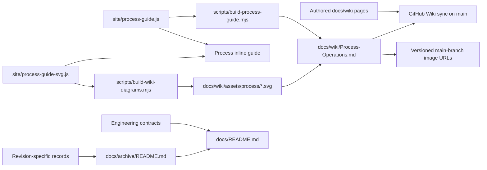

# Documentation architecture and maintenance

## Authority and readers

[The documentation map](README.md) is the repository navigation root. [The root README](../README.md) introduces the product and links here; it should summarize rather than duplicate implementation details.

| Layer                      | Source and purpose                                                                                  | Maintenance rule                                                                                                                           |
| -------------------------- | --------------------------------------------------------------------------------------------------- | ------------------------------------------------------------------------------------------------------------------------------------------ |
| Product manual             | `docs/wiki/`: tasks, controls, Recipe syntax, examples and modeling limits                          | Authored pages describe shipped behavior; `Process-Operations.md` is generated. English/Chinese tutorials share the same parser contract.  |
| Engineering contracts      | Architecture, Development, Testing, CI and the scientific/interchange documents linked from the map | Own module boundaries, invariants and acceptance. Update the owning contract when behavior changes.                                        |
| Forward plans              | Renderer transparency roadmap                                                                       | Label measured evidence, proposals and open acceptance separately; a proposed feature is not a current contract.                           |
| Revision-specific evidence | [Archive index](archive/README.md)                                                                  | Preserve dates, SHAs, environments and original results. Add a status/provenance banner rather than rewriting old measurements as current. |

The implementation and meaningful regression tests establish shipped behavior. When a document disagrees with them, investigate and reconcile the owning contract; do not silently relax a test to agree with prose. A screenshot, chat or ignored artifact is supporting evidence, not a portable source of truth. Third-party research snapshots are not continuously verified vendor capability catalogs.

## Sources, generated content and publication

- Edit operation names/descriptions in `site/process-guide.js` and illustrations in `site/process-guide-svg.js`; run `npm run docs:build` and commit the generated operation reference **and all affected SVG assets** with their sources. The old `site/guide/` route is a compatibility redirect to the Wiki.
- Edit other Wiki pages directly. `site/bundled-examples.js` owns the six-family Welcome catalog; its IDs, titles and DOI provenance must agree with the examples chapter.
- `docs/wiki/_Sidebar.md` and `Home.md` own manual navigation. Wiki-relative links omit `.md`; repository-relative links include real filenames. Use links, rather than inline code paths, when readers should open a file.
- [Wiki sync](WIKI_SYNC.md) owns credentials and managed-page replacement. [CI routing](CI.md) owns trigger behavior. Wiki checks run on every main push; referenced SVG assets are served from versioned repository files through main-branch raw URLs. Pages is independently path-filtered. A repository commit, a successful Wiki sync and a successful Pages deployment are distinct evidence.

## Change workflow

1. Identify the owning engineering contract and affected manual task, including both Recipe tutorials when syntax/units change.
2. Check the current implementation and relevant tests; preserve inferred-versus-source-reported scientific provenance.
3. Update authored pages, regenerate only derived content, and keep previous evidence revision-specific.
4. Add or update the map/archive link for a new document. All Markdown under `docs/` must be reachable from `docs/README.md`; do not move historical paths merely to reorganize the index.
5. Run `npm run docs:check`, `npm run format:check`, and the focused documentation/guide tests. Code changes still require the checks owned by [Testing](testing.md).
6. Record the audited product SHA, exact commands/results and limits in a dated handoff. Publish under the user's existing authorization and verify the remote revision; main publication is not proof that deployment finished.

## Automated checks and their limits

`npm run docs:check` checks generated operation output, managed manual pages, all tracked/new non-ignored Markdown internal destinations and headings, documentation reachability, current Architecture module paths, published Welcome links and atlas operation IDs. The standalone link/navigation gate is `node scripts/check-documentation.mjs` and uses only Node built-ins plus the existing application catalogs.

`site/tests/wiki-manual.test.mjs` checks the catalog and parses the actual English/Chinese Recipe code examples. `site/tests/documentation.test.mjs` owns link/navigation parser and negative-fixture coverage. The Wiki publishing workflow runs the same documentation checks before synchronization.

These checks cannot prove prose/scientific correctness, execute every example as a fabrication process, validate external DOI/vendor URLs, certify the live Wiki/Pages deployment, or accept pixel baselines. External research statements retain their recorded date; full replay and visual acceptance remain in their scientific/browser suites.
